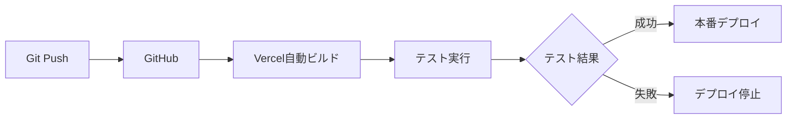

# デプロイ戦略・方針

## 📋 概要

植物観察アプリのデプロイ戦略と方針を定義します。開発環境から本番環境まで、段階的かつ安全なデプロイメントを実現します。

## 🎯 デプロイ目標

### 主要目標
- **安全性**: 本番環境への安全なデプロイメント
- **効率性**: 自動化による迅速なデプロイ
- **品質**: テスト済みコードのみをデプロイ
- **可用性**: ダウンタイムゼロのデプロイ

### パフォーマンス目標
- **初回表示**: 3秒以内
- **ページ遷移**: 1秒以内
- **画像読み込み**: 2秒以内
- **API応答**: 500ms以内

## 🏗️ デプロイ環境構成

### 環境分離
```
開発環境 (Local) → ステージング環境 → 本番環境
     ↓              ↓              ↓
  localhost    staging.vercel.app  your-app.vercel.app
```

### 各環境の役割

#### 1. 開発環境 (Local)
- **目的**: 機能開発・デバッグ
- **データベース**: Supabase Local
- **URL**: `http://localhost:3000`
- **特徴**: ホットリロード、開発ツール有効

#### 2. ステージング環境
- **目的**: リリース前最終確認
- **データベース**: Supabase Staging
- **URL**: `staging-plantlog.vercel.app`
- **特徴**: 本番環境と同等の設定

#### 3. 本番環境
- **目的**: エンドユーザー向けサービス
- **データベース**: Supabase Production
- **URL**: `plantlog.vercel.app`
- **特徴**: 最適化済み、監視有効

## 🛠️ 技術スタック

### フロントエンド
- **プラットフォーム**: Vercel
- **フレームワーク**: Next.js 15.4.2
- **ビルドツール**: Turbopack
- **CDN**: Vercel Edge Network

### バックエンド・データベース
- **BaaS**: Supabase
- **データベース**: PostgreSQL
- **認証**: Supabase Auth
- **ストレージ**: Supabase Storage

### ドメイン・SSL
- **ドメイン**: Vercel提供サブドメイン
- **SSL**: 自動取得・更新
- **カスタムドメイン**: 将来的に検討

## 📦 デプロイフロー

### 1. 自動デプロイ (推奨)


### 2. 手動デプロイ (緊急時)
```bash
# Vercel CLIを使用
npm run build
vercel --prod
```

### 3. ブランチ戦略
- **main**: 本番環境デプロイ
- **develop**: ステージング環境デプロイ
- **feature/***: プレビューデプロイ

## 🔧 デプロイ設定

### Vercel設定 (vercel.json)
```json
{
  "framework": "nextjs",
  "buildCommand": "npm run build",
  "outputDirectory": ".next",
  "installCommand": "npm install",
  "devCommand": "npm run dev",
  "env": {
    "NEXT_PUBLIC_SUPABASE_URL": "@supabase-url",
    "NEXT_PUBLIC_SUPABASE_ANON_KEY": "@supabase-anon-key"
  }
}
```

### 環境変数管理
#### 開発環境 (.env.local)
```env
NEXT_PUBLIC_SUPABASE_URL=http://127.0.0.1:54321
NEXT_PUBLIC_SUPABASE_ANON_KEY=eyJhbGciOiJIUzI1NiIsInR5cCI6IkpXVCJ9...
```

#### 本番環境 (Vercel Dashboard)
```env
NEXT_PUBLIC_SUPABASE_URL=https://your-project.supabase.co
NEXT_PUBLIC_SUPABASE_ANON_KEY=your-production-anon-key
```

## 🧪 デプロイ前チェックリスト

### 必須チェック項目
- [ ] **ビルド成功**: `npm run build`
- [ ] **型チェック**: `npm run type-check`
- [ ] **Lint**: `npm run lint`
- [ ] **フォーマット**: `npm run format:check`
- [ ] **環境変数設定**: 本番用の値に更新
- [ ] **Supabase設定**: RLS、セキュリティポリシー確認

### 機能テスト項目
- [ ] **認証機能**: ログイン・サインアップ・ログアウト
- [ ] **植物登録**: 新規登録・編集・削除
- [ ] **観察記録**: 記録作成・表示・編集
- [ ] **水やり管理**: スケジュール・記録
- [ ] **画像アップロード**: 写真添付・削除
- [ ] **レスポンシブ**: モバイル・デスクトップ表示

### パフォーマンステスト
- [ ] **ページ速度**: Lighthouse Score 90+
- [ ] **Core Web Vitals**: 全指標グリーン
- [ ] **画像最適化**: Next.js Image最適化確認
- [ ] **バンドルサイズ**: 適切なCode Splitting

## 🚀 デプロイ手順

### 初回デプロイ
```bash
# 1. Supabase本番プロジェクト作成
supabase projects create plantlog

# 2. データベーススキーマ適用
supabase db push --db-url "your-production-db-url"

# 3. Vercelプロジェクト作成・デプロイ
vercel
```

### 定期デプロイ
```bash
# 1. 開発完了後、mainブランチにマージ
git checkout main
git merge develop

# 2. 自動デプロイ実行 (GitHub連携済みの場合)
git push origin main

# 3. デプロイ確認
# Vercel Dashboardで状況確認
```

## 📊 監視・メトリクス

### パフォーマンス監視
- **Vercel Analytics**: アクセス解析
- **Web Vitals**: パフォーマンス指標
- **Error Tracking**: エラー監視

### Supabase監視
- **Database Usage**: データベース使用量
- **API Requests**: APIリクエスト数
- **Auth Events**: 認証イベント

### アラート設定
- **エラー率**: 5%以上でアラート
- **レスポンス時間**: 3秒以上でアラート
- **データベース容量**: 80%以上でアラート

## 🔄 ロールバック戦略

### 自動ロールバック
- ビルド失敗時は前バージョンを維持
- ヘルスチェック失敗時は自動復旧

### 手動ロールバック
```bash
# Vercel CLIでの緊急ロールバック
vercel rollback [deployment-url]
```

### データベースロールバック
```bash
# マイグレーション巻き戻し
supabase migration down
```

## 💰 コスト管理

### 無料枠での運用
#### Vercel無料プラン
- **転送量**: 100GB/月
- **ビルド**: 100回/月
- **関数実行**: 100GB-時間/月

#### Supabase無料プラン
- **データベース**: 500MB
- **認証**: 50,000ユーザー/月
- **ストレージ**: 1GB
- **API**: 2M API requests/月

### コスト最適化施策
- **画像最適化**: Next.js Image最適化
- **Code Splitting**: 必要な部分のみ読み込み
- **キャッシング**: Static Generation活用
- **CDN活用**: Vercel Edge Network

## 🛡️ セキュリティ対策

### デプロイセキュリティ
- **環境変数**: 機密情報の適切な管理
- **HTTPS**: 強制SSL/TLS
- **セキュリティヘッダー**: XSS、CSRF対策
- **依存関係**: 脆弱性スキャン

### Supabaseセキュリティ
- **RLS**: Row Level Security有効
- **API Keys**: Anon Keyのみ公開
- **CORS**: 適切なオリジン設定
- **認証**: JWT検証

## 🔮 将来の拡張計画

### Phase 1: 基本デプロイ (現在)
- Vercel + Supabase無料プラン
- 基本機能のデプロイ

### Phase 2: 最適化 (3ヶ月後)
- カスタムドメイン導入
- パフォーマンス最適化
- 監視強化

### Phase 3: スケールアップ (6ヶ月後)
- 有料プラン移行検討
- 高度な分析機能
- PWA対応

## 📚 参考資料

### 技術ドキュメント
- [Vercelデプロイガイド](https://vercel.com/docs/deployments)
- [Next.jsデプロイメント](https://nextjs.org/docs/deployment)
- [Supabase本番環境](https://supabase.com/docs/guides/platform/going-to-prod)

### ベストプラクティス
- [Vercelセキュリティ](https://vercel.com/docs/security)
- [Next.jsパフォーマンス](https://nextjs.org/docs/advanced-features/measuring-performance)
- [Web Vitals最適化](https://web.dev/vitals/)

## ✅ アクションアイテム

### 即座に実行
- [ ] Supabase本番プロジェクト作成
- [ ] Vercelアカウント作成・プロジェクト連携
- [ ] 環境変数設定
- [ ] 初回デプロイ実行

### 1週間以内
- [ ] ドメイン名決定
- [ ] 監視設定
- [ ] バックアップ戦略策定
- [ ] ドキュメント整備

### 1ヶ月以内
- [ ] パフォーマンス最適化
- [ ] セキュリティ監査
- [ ] ユーザーフィードバック収集
- [ ] 次期機能計画

---

**📝 更新履歴**
- 2025年7月28日: 初版作成
- 定期的にアップデートすること